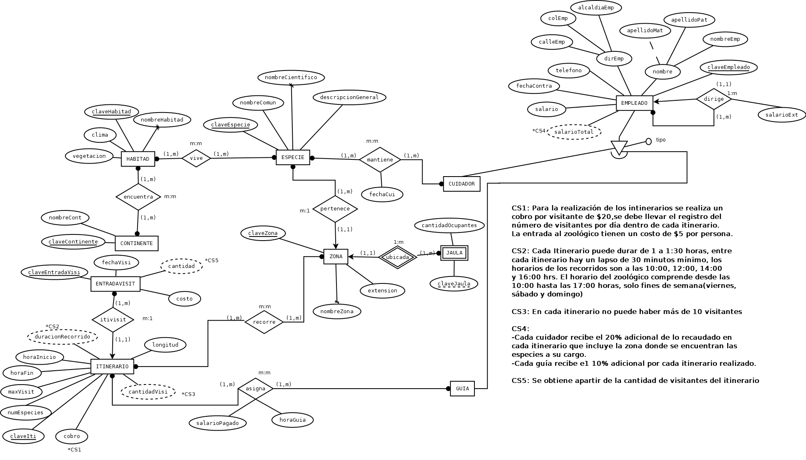
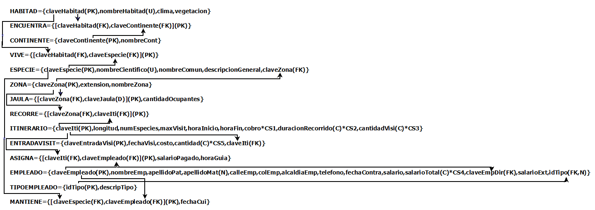
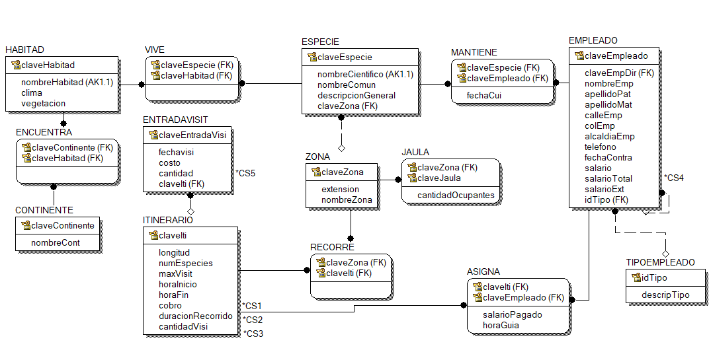
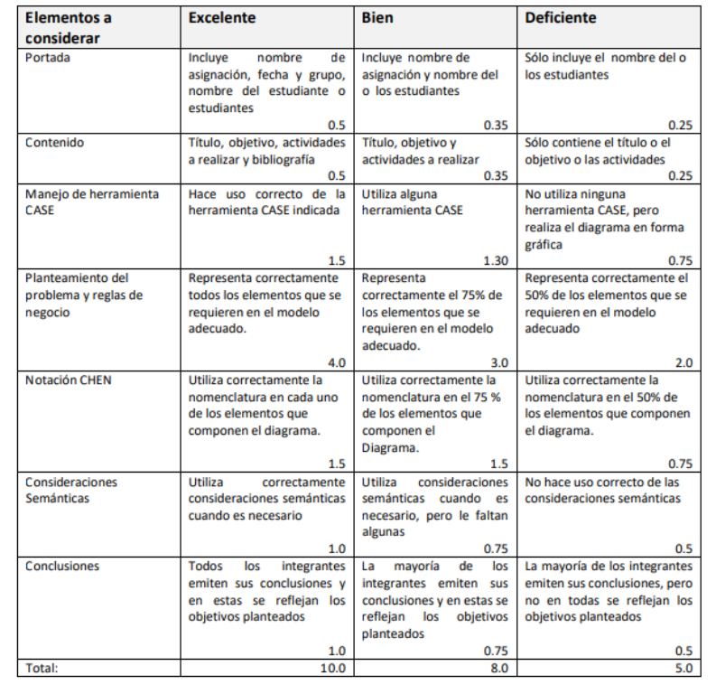

Universidad Nacional Autónoma de México
Faculta de Ingeniería
Bases de Datos
Grupo: 03
Proyecto Final
Equipo #6
Integrantes
Barrera Peña Víctor Miguel

Fecha de entrega: 10/01/2021

# Objetivo

El alumno mostrará los conocimientos adquiridos para la conversión de diagramas
Entidad Relación a el modelo Relacional, la respectiva creación del diccionario de datos y si fuera
necesario la normalización.

# Enunciado del problema

En un zoológico se necesita llevar la organización respecto a las especies que posee, los empleados
y los distintos itinerarios de visita que ofrece. La información que se tiene es la siguiente:

Especies: de las especies sabemos el nombre común, el nombre científico y una descripción general.
Hay que tener en cuenta que una especie puede vivir en diferentes hábitats naturales y que un hábitat puede ser ocupado por diferentes especies. Las especies se encuentran en distintas zonas del parque de manera que cada especie está en una zona y en una zona hay varias especies. Cada especie, se encuentra ubicada en una jaula dentro de una zona, de la cual sabemos su número de jaula y cantidad de ocupantes, éstos se repiten en cada zona.

Hábitats: de los diferentes hábitats naturales se tiene el nombre, el clima y el tipo de vegetaciones predominantes, así como el continente o continentes en los que se encuentran, de éstos tenemos
clave y nombre.

Zonas: las zonas del parque en las que se encuentran las distintas especies vienen definidas por el nombre y la extensión que ocupan.

Itinerarios: los itinerarios se realizan por distintas zonas del parque, de éstos se tiene el código de itinerario, la duración del recorrido, hora de inicio y hora de fin, la longitud del itinerario, el máximo número de visitantes autorizados y el número de distintas especies que visita. Hay que tener en cuenta que un itinerario recorre distintas zonas del parque y que una zona puede ser recorrida por diferentes itinerarios. Para la realización de los itinerarios se realiza un cobro por visitante de $20, se debe llevar el registro del número de visitantes por día dentro de cada itinerario.

Empleados: de los empleados tenemos su clave de empleado, nombre completo, dirección, teléfono y fecha de contratación en el zoológico, todos los empleados están a cargo de un responsable que también es un empleado, entre los empleados tenemos guías y cuidadores. Es importante saber que
guías llevan qué itinerarios, teniendo en cuenta que un guía puede llevar varios itinerarios y que un itinerario puede ser asignado a diferentes guías en diferentes horas, siendo éstas un dato de interés; de los cuidadores hay que tener en cuenta que pueden estar a cargo de varias especies y que una

## Consideraciones

- La entrada al zoológico tiene un costo de \$5 por persona
-  Cada itinerario puede durar de 1 a 1:30 horas, entre cada itinerario hay un lapso de 30 minutos
  mínimo, los horarios de los recorridos son a las 10:00, 12:00, 14:00 y 16:00 hrs.
- El horario del zoológico comprende desde las 10:00 hasta las 17:00 horas, solo fines de semana
  (viernes, sábado y domingo)
- En cada itinerario no puede haber más de 10 visitantes
- Cada empleado recibe un sueldo básico mensual de \$4000
- Cada empleado responsable percibe $1000 extra
- Cada cuidador recibe el 20% adicional de lo recaudado en cada itinerario que incluya la zona donde
  se encuentran las especies a su cargo.
- Cada guía recibe el 10% adicional por cada itinerario realizado

## Se desea conocer

- Cuántas especies hay en el zoológico por zona
- Número de visitantes por fecha especificada, por itinerario y el monto total obtenido por cada
  itinerario
- Salario pagado a cada guía, donde se muestre la fecha, cantidad obtenida por recorrido.
- Salario pagado a cada cuidador, donde se muestre la fecha, cantidad obtenida por recorrido
  que corresponda a su zona
- Salario promedio pagado a los empleados según su puesto
- Aguinaldo que se les deberá de pagar por el año en curso a cada empleado, considerando 5 días
  al inicio y 2 días por cada año laborado.
- Visitas realizadas a cada zona por día (fecha específica)
- Información de cada especie mostrando además el nombre del cuidador a cargo, la lista de jaulas y cantidad de ocupantes, y las zonas donde se encuentran.
- Información de cada uno de los guías correspondiente a las zonas que visito en cada itinerario,
  cuantas personas asistieron y en qué fecha

# Diseño conceptual

# Diseño Conceptual (modelo ER)

## Modelo esquemático

**Restricciones**

- CS1: Para la realización de los itinerarios se realiza un cobro por visitante de 20\$,se debe llevar el registro del número de visitantes por día dentro de cada itinerario. La entrada al zoológico tiene un costo de $ 5 por persona. 
- CS2: Cada Itinerario puede durar de 1 a 1:30 horas, entre cada itinerario hay un lapso de 30 minutos mínimo, los horarios de los recorridos son a las 10:00, 12:00, 14:00 y 16:00 hrs. El horario del zoológico comprende desde las 10:00 hasta las 17:00 horas, solo fines de semana(viernes, sábado y domingo) .
- CS3: En cada itinerario no puede haber más de 10 visitantes 
- CS4:
  - Cada cuidador recibe el $20 % adicional de lo recaudado en cada itinerario que incluye la zona donde se encuentran las especies a su cargo.
  -	Cada guía recibe el 10 % adicional por cada itinerario realizado.
-	CS5: Se obtiene a partir de la cantidad de visitantes del itinerario.

# Diseño Lógico (modelo Relacional, normalización y diccionario de datos)

## Modelo relacional

## Normalización

## Diccionario de datos

# Diseño Físico o DDL o DML o pl/sql

## Contiene

- Procedimientos para alta, baja y actualización en todas las relaciones
- Vistas para realizar consultas
- Funciones de los cálculos realizados
- Procedimientos almacenados
- Disparadores

## Pasos para la realización SQL

1. Esquema básico

# Rúbrica

# Referencias

